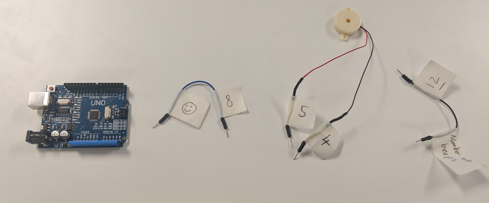

# Arduino Collaboration Puzzle
Arduino based collaboration puzzle made for Lewisham Library Code Club.

This activity is designed to replicate the scenario where multiple teams are trying to solve their own problems, whilst other teams are asking for information required to solve their problem. In other words:  cross team collaboration in solving different problems.

## The Setup

4 teams, each with and arduino and a different set of components.

They need to wire the components up correctly to complete the puzzle. 

The components are labeled with what numbered pins they connect to. 

**THE TWIST**, some components have pictures instead of numbers.

These pictures also appear in the "*Clues*" section on the instruction sheet.

**THE TWIST CONTINUES**, the pictures you might be looking for may be on another team's sheet.

You have to ask the other team if they have the picture you’re looking for (you are not allowed to just peek at other teams sheets).

Eventually if you communicate well enough and wire the Arduino correctly you will see a fast flashing light on the board indicating that you have solved the puzzle.

Then the teams all rotate to the next puzzle until all teams have had a go on each.

---

## Example Solution to Puzzle B

First you start with the components and the sheet indicate that you need to start with the blue wire, then the speaker, then the black wire.

The blue wires connects to pin 8 and to pin [number of smiley faces]. You find out from another team that it's 7.

You connect the blue wire, and when you power on the board you get 1 solid flash indicating that the first wire is correct.

Next the speaker is labeled with 4 and 5, so you connect it to pins 4 and 5 on the Arduino.

When you power on the board now you hear 6 beeps from the speaker.

The last wired is labeled with 12 and "number of beeps". So you connect it to 12 and 6 and the board now flashes when you power it on, indicating that you have completed the puzzle.

